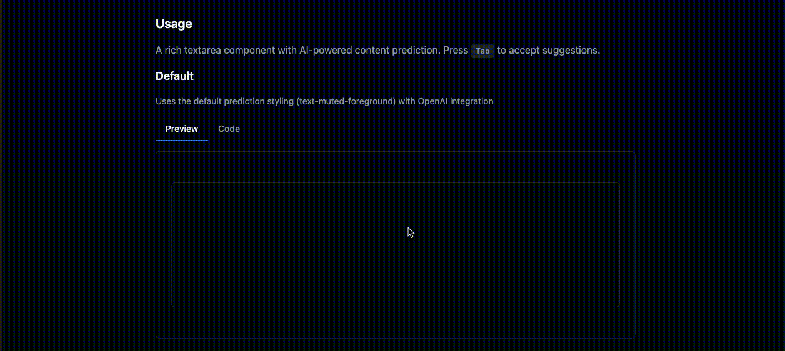

# Predictive Textarea

A textarea component with AI-powered content prediction for React applications. It enables predictive text suggestions as users type, similar to GitHub Copilot's ghost text feature.

## Features

- 🤖 AI-powered content predictions
- 📱 Responsive design
- 🎨 Customizable styling
- 🧩 Easy integration with form libraries
- ♿ Accessible design
- 💻 Framework-agnostic (works with or without shadcn/ui)

## Demo

You can see a demo of the component [here](https://predictive-textarea.vercel.app/) which includes options to test different variations of the component.



## Installation

```bash
npm install predictive-textarea
# or
yarn add predictive-textarea
# or
pnpm add predictive-textarea
```

## Dependencies

The component has minimal dependencies:

- **React**: As this is a React component
- **Tailwind CSS**: For styling (or you can provide custom classes)
- **uuid**: Used internally for prediction ID generation

## Local Demo

To run the demo locally:

```bash
# Install dependencies
yarn install

# Run the demo
yarn demo
```

The demo shows different examples of the PredictiveTextarea component:
- Basic usage with content prediction
- Disabled state
- Pre-filled content

Press Tab to accept suggestions when they appear.

## Development

This project provides two environments for development:

### Development Server

Run the development server for local development:

```bash
# Start the development server (Vite)
yarn dev
```

The development server is located in the `dev/` directory and provides a sandbox environment for testing and developing the component.

### Demo Application

Run the demo application to see the component in action in various scenarios:

```bash
# Run the Next.js demo
yarn demo
```

The demo is located in the `demo/` directory and showcases different usage examples of the component in a Next.js application.

## Usage

```tsx
import React from 'react';
import { PredictiveTextarea } from 'predictive-textarea';

// Your content prediction function
// This should connect to your AI service that generates predictions and return a string
async function getContentPrediction(text: string): Promise<string> {
  const response = await fetch('your-prediction-api-endpoint', {
    method: 'POST',
    headers: { 'Content-Type': 'application/json' },
    body: JSON.stringify({ text }),
  });
  
  const data = await response.json();
  return data.prediction || '';
}

function MyForm() {
  return (
    <div className="my-form">
      <label htmlFor="content">Content:</label>
      <PredictiveTextarea
        name="content"
        getContentPredictionFn={getContentPrediction}
        debounceTime={300}
        placeholder="Start typing..."
      />
      <button type="submit">Submit</button>
    </div>
  );
}

export default MyForm;
```

## OpenAI Integration

This package includes built-in OpenAI integration for text predictions.

To use the OpenAI integration in a Next.js app:

```typescript
// app/actions.ts
'use server'

import { predictInputContent } from 'predictive-textarea/openai'

export async function getPrediction(text: string) {
  return predictInputContent(text)
}

// app/components/my-textarea.tsx
'use client'
import { PredictiveTextarea } from 'predictive-textarea'
import { getPrediction } from '../actions'

export function MyTextarea() {
  return <PredictiveTextarea getContentPredictionFn={getPrediction} />
}
```

In order to use the OpenAI integration, you need to set the `OPENAI_API_KEY` environment variable in your Next.js application.
The `OPENAI_MODEL` environment variable is optional and defaults to `gpt-4o-mini`.

## Props

| Name | Type | Required | Description |
|------|------|----------|-------------|
| `getContentPredictionFn` | `(text: string, abortSignal?: AbortSignal) => string \| Promise<string>` | Yes | Function that returns prediction text based on user input |
| `debounceTime` | `number` | No | Time to wait after typing stops before fetching predictions (ms) |
| `disabled` | `boolean` | No | Disables the textarea |
| `placeholder` | `string` | No | Placeholder text |
| `value` | `string` | No | Initial value |
| `rows` | `number` | No | Number of rows to display (default: 1) |
| `className` | `string` | No | Additional CSS classes for the textarea container |
| `predictionClassName` | `string` | No | Additional CSS classes for the prediction text |
| `...props` | `React.HTMLAttributes<HTMLDivElement>` | No | Any other props are passed to the underlying div |


## Styling

The component uses utility classes that are compatible with Tailwind CSS by default.

To customize the appearance, you can provide a `className` prop:

```tsx
<PredictiveTextarea
  getContentPredictionFn={getContentPrediction}
  className="min-h-[200px] font-mono bg-gray-100 dark:bg-gray-800"
/>
```

### Integration with UI Libraries

This component is designed to be framework-agnostic and can be integrated with any UI library. The component uses Tailwind CSS conventions that make it easy to customize:

- It uses standard Tailwind CSS class naming conventions
- It follows common styling patterns for focus states, borders, and other UI elements
- The demo showcases integration with various UI component structures and themes

## Caching and Performance

The PredictiveTextarea component includes built-in caching and performance optimization features to minimize API calls and improve user experience.

### Content Prediction Caching

The component uses a trie-based caching mechanism to store and retrieve predictions:

- Previously requested predictions are cached to avoid redundant API calls
- The cache is optimized for prefix matching, making it efficient for text input scenarios
- Default cache size is 100 entries, providing a balance between memory usage and performance

```tsx
// Example showing caching behavior
function MyForm() {
  // This function will only be called once for the same input
  // even if the component re-renders
  async function getContentPrediction(text: string) {
    console.log('Making API call for:', text);
    // Your prediction API call here
    return 'predicted text';
  }

  return (
    <PredictiveTextarea
      getContentPredictionFn={getContentPrediction}
      debounceTime={300} // Configure debounce time
    />
  );
}
```

### Debouncing Mechanism

To prevent excessive API calls as users type:

- Input requests are debounced by default (300ms)
- Adjustable via the `debounceTime` prop to match your use case
- Optimizes the balance between responsiveness and API usage

```tsx
+import React from 'react';  
+import { PredictiveTextarea } from 'predictive-textarea';  
+  
 function MyComponent() {  
   return (  
     <PredictiveTextarea  
       getContentPredictionFn={getContentPrediction}  
       debounceTime={500} // Increase to 500ms for slower typing or expensive API calls  
     />  
   );  
 } 
```

### Performance Benefits

The caching and debouncing mechanisms provide several performance benefits:

- Reduced API calls, especially for repetitive text patterns
- Improved user experience during backspace operations where cached predictions can be reused
- Lower latency for cached predictions (near-instant suggestions)
- Deterministic prediction IDs ensure proper component rerendering

While the cache is configured with sensible defaults, you can customize its behavior by adjusting the `debounceTime` prop:

- Lower values (e.g., 100ms) provide more responsive predictions but increase API calls
- Higher values (e.g., 500ms) reduce API calls but may feel less responsive
- The default value (300ms) provides a good balance for most use cases

## Attribution

This component was inspired by and adapted from [react-ghost-text](https://github.com/agdhruv/react-ghost-text).
